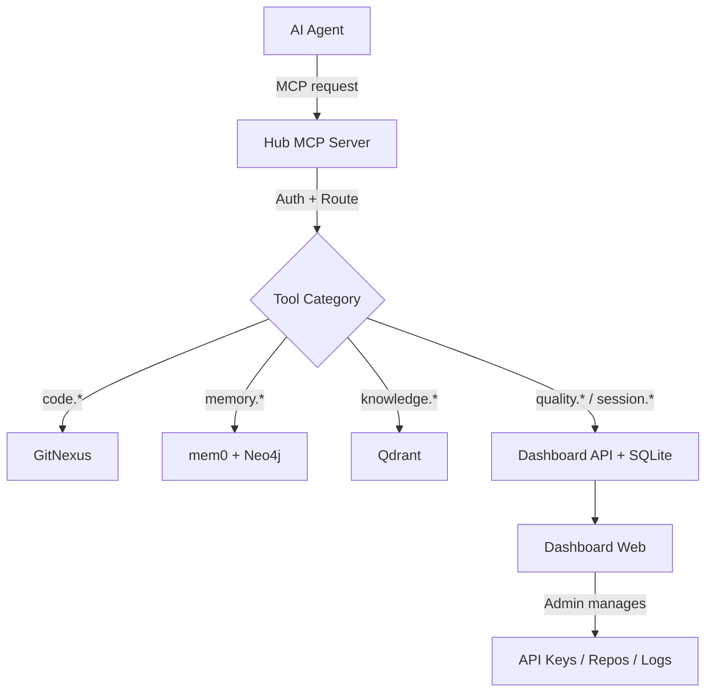

# BA Analysis Package — Cortex Hub

**Date:** 2026-03-18
**BA Completeness Score:** 7.0/7 average across requirements
**Feasibility Score:** 17.1/20

## Stakeholders

| Stakeholder | Role | Power | Interest | Key Concerns | Strategy |
|-------------|------|-------|----------|--------------|----------|
| Project Owner (tieple) | Decision maker, primary developer | High | High | Fast setup, streamlined UX, production-grade quality | Manage Closely |
| AI Agents (Antigravity, GoClaw) | End users (automated) | Low | High | Reliable MCP endpoint, low latency, comprehensive tools | Keep Informed |
| Team members (future) | API key consumers | Medium | High | Easy API key provisioning, clear usage tracking | Keep Informed |

## Validated Requirements

13 requirements validated — all scoring 7/7 on 6W1H framework.

### Must Have (P0)
- **R001** MCP Gateway — single Cloudflare Worker endpoint for all agent tools
- **R002** Code Intelligence — GitNexus semantic search, impact analysis, symbol context
- **R003** Agent Memory — mem0-backed persistent cross-session memory
- **R012** Docker Backend — Qdrant + Neo4j + mem0 + GitNexus via Docker Compose
- **R013** Cloudflare Tunnel — zero-trust server exposure

### Should Have (P1)
- **R004** Knowledge Base — auto-contribution + human curation via Qdrant
- **R005** Quality Gates — 4-dimension scoring, grade system, trend tracking
- **R006** Session Handoff — structured context transfer between agents
- **R009** API Key Management — create/revoke per agent with usage tracking

### Could Have (P2)
- **R007** OAuth Quick-Start — GitHub/OpenAI login for instant setup
- **R008** GitHub Repo Import — web UI for public/private repo onboarding
- **R010** Real-Time Logging — WebSocket streaming with agent/tool filters
- **R011** Dashboard Web App — 8-screen admin interface

## Business Process

### Current State (AS-IS)
No existing process — greenfield project. Currently agents (Antigravity, GoClaw) operate independently with no shared state. Each agent maintains its own memory, each codebase requires separate GitNexus configuration, and there is no central management interface.

### Desired State (TO-BE)

## Feasibility Summary

| Verdict | Count | Details |
|---------|-------|---------|
| ✅ Highly feasible | 8 | Backend services, MCP gateway, infrastructure |
| ⚠️ Feasible with risks | 5 | Frontend dashboard, OAuth, real-time features |
| ❌ Not feasible | 0 | — |

Key risk: Frontend development workload across 8+ screens. Mitigated by phasing — build core screens (Overview, API Keys, Logs) first.

## Critical Findings

1. **No contradictions detected** — all requirements are consistent
2. **Tech stack is homogeneous** — TypeScript end-to-end reduces context switching
3. **Cost is near-zero** — entire stack runs on free tiers + self-hosted server
4. **Deployment dependency** — Cloudflare Tunnel requires server access (pending VPN connection)

## Documented Assumptions

| Assumption | Owner | Risk if Wrong |
|------------|-------|---------------|
| Server has Docker 24+ and Node.js 22 LTS | Owner | Medium — may need provisioning |
| Cloudflare free tier sufficient for traffic | Owner | Low — 100K req/day is generous |
| Single admin user initially | Owner | Low — multi-user can be added later |
| SQLite WAL mode sufficient for Dashboard DB | BA | Low — can migrate to PG if needed |

## Open Questions

1. **Server specs** — CPU/RAM/disk of target self-hosted server (affects Docker resource allocation)
2. **Domain** — Custom domain for dashboard + MCP endpoint?
3. **GitHub Organization** — Personal or org account for repo hosting?

## Recommended Priority (MoSCoW)

| Priority | Requirements |
|----------|-------------|
| **Must** | R001, R002, R003, R012, R013 |
| **Should** | R004, R005, R006, R009 |
| **Could** | R007, R008, R010, R011 |
| **Won't (v1)** | Plugin marketplace, mobile PWA, agent leaderboard |

## Traceability Matrix

| Requirement ID | Source | Date Captured | Validated By |
|---------------|-------|---------------|--------------|
| R001–R006 | README.md, tech-stack.md, hub-mcp-reference.md | 2026-03-18 | BA (doc analysis) |
| R007–R010 | User feedback during Forgewright onboarding | 2026-03-18 | BA (direct capture) |
| R011–R013 | README.md, project-profile.json, task.md | 2026-03-18 | BA (doc analysis) |
